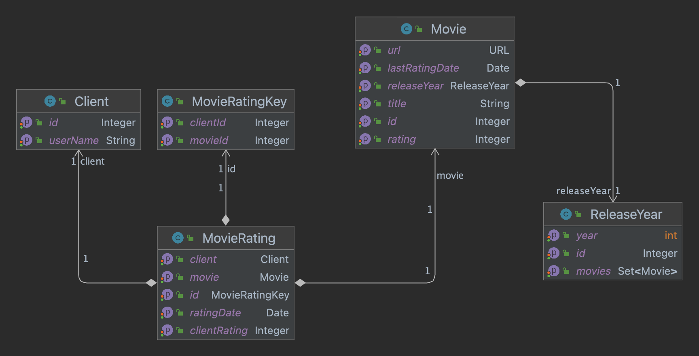

# API Challenge - Movie Catalog

## Introduction
Design and create a RESTful API that could be used to manage a list of Movie images. The API is meant to act as the backend to the Movie Category API, which is being built by a different team.

### The operations we expect to see would be:

* List all of the available Movie pictures grouped by Release year
* List all of the available Movie pictures of a particular Release year
* Vote up and down a Movie picture
* The details associated with a Movie picture

### The information the Movie Category App needs to function is:
* A URL to a movie picture
* The number of time the movie picture was favorited
* The Movie’s Release year
* Any other information required to identify a specific Movie

The Movie Category App expects the response to be sorted by the number of times the movie picture was favorited. The pictures may be sorted
The API responses must be in JSON.
### Additional Voting Requirements
* Each client is allowed to vote once for any particular Movie picture.

### What is expected:
* Create API’s
* Write test cases(Code coverage should be above 85%)
* Implement swagger
* Create Postman collection and be ready with Postman or SoapUI.

# Implementation

The project was built with Java 17 and Spring boot 3.2.3, these are the principal characteristics of the project
* REST API services built with SpringBoot @RestController
* It has 3 layers: 
  * **Controller:** Define the endpoints and it uses the next layer 
  * **Service:** It has the business logic and interacts with the Repository and Controller
  * **Repository:** It is responsible for the database access

### Entity model 
* The rating is stored in a MovieRating entity to ensure that a client can only vote once
+ Movie entity has a field **rating** that stores the total rating value, and **lastRatingDate** to store the last time a movie received a rating, 
these values could be calculated using the MovieRating Entity but with more users and movies that could affect performance

### DTO
In this project we are using DTO to decouple the entity layer with the objects sed in the REST API, 
with this design we can easily define the fields we want to use in the REST services

### Swagger UI
The URL to see the Swagger UI is
http://movies.testmycloud.net/swagger-ui/index.html

### Github
There is github action to build and run the tests in this project
https://github.com/garcianajera/movies/actions

### Testing Requirements

* List all of the available Movie pictures grouped by Release year
  * We use a release year entity to group movies by year. Results order by year and movie rating
    http://movies.testmycloud.net/api/releaseYears
* List all of the available Movie pictures of a particular Release year
    http://movies.testmycloud.net/api/releaseYears/2020/movies
* Vote up and down a Movie picture
  * A client can only vote once per movie, we ensure that with the MovieRating Entity
    http://movies.testmycloud.net/swagger-ui/index.html#/movie-rating-controller/voteUp
    http://movies.testmycloud.net/swagger-ui/index.html#/movie-rating-controller/voteDown
* The details associated with a Movie picture
http://movies.testmycloud.net/api/movies/1

